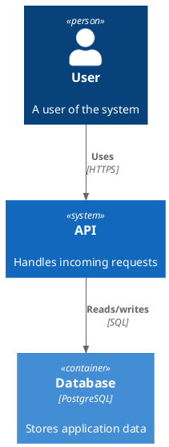
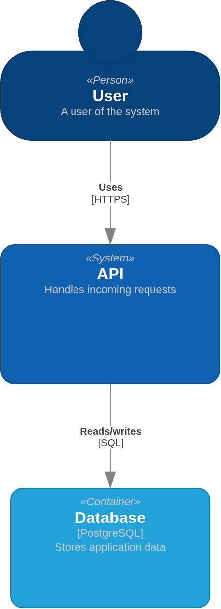

[](https://github.com/AndriyKalashnykov/catalyst/actions/workflows/ci.yml)
[](https://hits.sh/github.com/AndriyKalashnykov/catalyst/)
[](LICENSE)
[](https://app.renovatebot.com/dashboard#github/AndriyKalashnykov/catalyst)

# Catalyst — draw.io converter for PlantUML C4 & sequence diagrams

<div align="center">
  
</div>

JavaScript/TypeScript library that converts C4 **and sequence** diagrams
written in PlantUML (`.puml`) into [draw.io](https://draw.io) XML — no PlantUML runtime
required. The **consumer surface** is a one-call API
(`Catalyst.convert(puml, options)`) plus `parseEntities` / `parseRelations`,
installed as a git dependency. The **engine surface** uses
[Graphviz `dot`](https://graphviz.org/) — PlantUML's own C4 layout
engine — via the pinned, byte-deterministic
[`@hpcc-js/wasm-graphviz`](https://github.com/hpcc-systems/hpcc-js-wasm)
WASM build, so catalyst's topology matches the PlantUML reference by
construction (**0 non-incident edge crossings**, ADR 0014), with real
font-metric node sizing and a render-truth gate suite (structural
parity, golden snapshot, layout-quality, factcheck, edgecross,
arrowskew).

> **Project status:** independently maintained. As of **2.0.0** the
> layout engine is **Graphviz `dot`** (pinned `@hpcc-js/wasm-graphviz`
> WASM, byte-deterministic) — PlantUML's own C4 engine, so edge
> crossings drop to 0 by construction (ADR 0014, superseding the
> ELK ADRs 0008/0009/0011; the `elkjs` engine and the `layoutEngine`
> option were removed in 2.0.0). Real font-metric node sizing;
> structural-parity, golden-snapshot, layout-quality, factcheck,
> edgecross and arrowskew render-truth gates. Third-party
> copyright/license terms are retained in [LICENSE](LICENSE).
> Not published to npm — consumed as a git dependency.

## What a conversion looks like

[`sample/example.puml`](sample/example.puml) (left, rendered by
PlantUML) converts to `.drawio` (right, rendered by draw.io) — a fully
editable diagram in [diagrams.net](https://app.diagrams.net/) or the
VS Code Draw.io extension, **not a flat image**. catalyst lays out
with the *same* engine PlantUML uses (Graphviz `dot`), so the topology
matches by construction; draw.io then re-renders that layout with its
own renderer and fonts, so the two are never *pixel*-identical. What
catalyst guarantees is faithful **content + C4 grammar** — every box,
the `«stereotype»` / **Name** / `[Technology]` / description element
order, and every relationship verb with its `[technology]`.

> 🖼️ **See it on real diagrams: the [**full conversion gallery →
> `docs/gallery/`**](docs/gallery/)** — all **20 corpus fixtures**
> (deep-nested boundaries, deployment nodes, hub-and-spoke context,
> cyclic & disconnected topologies, tag styling, unicode/edge cases)
> rendered PlantUML-vs-draw.io side by side. Reproduce this pair with
> `make render-compare RENDER_SRC=sample/example.puml`, or the whole
> gallery with `make gallery`.

<p align="center">
  
  &nbsp;&nbsp;→&nbsp;&nbsp;
  
</p>

## Tech Stack

| Component | Technology |
|-----------|-----------|
| Language | TypeScript 6.0, ES2024 (`.mts` ESM) |
| Runtime | Node.js 26 (ES2024+), mise-managed (`.mise.toml`) |
| Layout engine | Graphviz `dot` via pinned `@hpcc-js/wasm-graphviz` (WASM, byte-deterministic) — PlantUML's own C4 engine; 0 edge crossings (ADR 0014) |
| Text metrics | fontkit + bundled Liberation Sans (SIL OFL) |
| Serialization | xml2js |
| Tests | Vitest — unit, structural parity, golden snapshot, layout quality, corpus sanity |
| Lint | oxlint + markdownlint (pinned `markdownlint-cli` devDependency) |
| Visual proof | PlantUML jar + `rlespinasse/drawio-export` (via `make render-compare` / `make gallery`) |

## Quick Start

This library is consumed as a **git dependency** (it is not on the npm
registry). Pin a tag:

```bash
# add to a project (npm resolves it under the package name "catalyst")
npm install github:AndriyKalashnykov/catalyst#v2.0.0

# development of catalyst itself
make deps      # mise install (node, act, gitleaks, trivy) + npm ci
make build     # compile TypeScript -> dist/
make test      # full vitest suite (fast; no coverage gate)
make ci        # full local pipeline == CI (static-check[lint+sec] +
               #   build + coverage-check[85%] + gallery-verify)
```

## Prerequisites

`mise` provides Node, Java (Temurin), and the CLI tools
(act/gitleaks/trivy) from `.mise.toml`; `make deps` bootstraps it. Only
graphviz has no mise backend — it is a system package needed solely for
the local render path, installed cross-platform by `./setup.sh`
(apt/dnf/brew/pacman, idempotent).

| Tool | Version | Purpose |
|------|---------|---------|
| [Node.js](https://nodejs.org/) | 26 (via mise) | Runtime and build |
| [Java](https://adoptium.net/) | Temurin 21 LTS (via mise) | `make render-compare` / `gallery` / `factcheck` (PlantUML `-tsvg`) |
| [GNU Make](https://www.gnu.org/software/make/) | 3.81+ | Build orchestration |
| [Git](https://git-scm.com/) | latest | Dependency resolution (git install) |
| [Docker](https://www.docker.com/) | latest | `make render-compare` / `gallery` / `ci-run` |
| [graphviz](https://graphviz.org/) | latest | PlantUML `-tsvg` layout — installed by `./setup.sh` |

```bash
make deps
```

## Layout engine

As of **2.0.0** catalyst lays out **every** C4 spec level with
**Graphviz `dot`** — *the same engine PlantUML itself uses* — via the
pinned, byte-deterministic [`@hpcc-js/wasm-graphviz`](https://github.com/hpcc-systems/hpcc-js-wasm)
WASM build (no system Graphviz needed at runtime). Because the engine
is identical to the reference renderer's, the topology matches by
construction rather than by approximation:

- **0 non-incident edge crossings** across the whole corpus
  (catalyst == PlantUML == 0), measured on the real drawio-export
  render-truth — `make edgecross` (ADR 0014). `dot`'s own port
  ordering fans parallel / `BiRel` / antiparallel same-pair edges, so
  the previous ELK-era lane-shove machinery (a frequent crossing
  source) was removed entirely.
- **Byte-deterministic**: identical input → byte-identical layout
  (proven cross-process; the WASM binary ships in the pinned npm
  tarball, identical across CI and host), which is what the gallery
  drift gates depend on.
- **`dot` splines emitted verbatim** as `curved=1` draw.io edges
  (ADR 0013) — no orthogonal re-route, no waypoint shoving.
- ADR 0014 supersedes the ELK-era ADRs 0008 (Context→layered),
  0009 (cycleBreaking) and 0011 (layout-aspect ratchet): under `dot`,
  Context ranking, aspect ratio and routing are correct by
  construction, not by tuned heuristics. The `elkjs` dependency, the
  `LayoutEngine`, and the `LAYOUT_ENGINE`/`layoutEngine` selector
  were removed in 2.0.0 — `dot` is the sole engine.

Node sizes are measured from the real label font (fontkit + bundled
Liberation Sans) and pinned into `dot` (`fixedsize=true`) at the
conventional C4 element-box size so rendered shapes never cram —
`dot` lays out, it does not re-measure text. Directional intent
(`Rel_U/D/L/R`) and `Lay_*` constraints map to `dot` ranking
(reversed/`rank=same`/invisible constraint edges).

Relationship rendering: the verb is shown bold with the technology
bracketed below it (an absent technology yields no `[]` artifact); entity
descriptions are preserved for every C4 element (including `Person`/`System`,
which have no technology parameter); `RelIndex(...)` dynamic relations are
parsed. Multiple relations between the **same node pair** (antiparallel
`Rel`+`Rel_Back` or parallel duplicates) are fanned by `dot`'s own port
ordering, so connectors never render collinear or stacked — without the
crossing-introducing perpendicular-shove the ELK path needed.

## Usage

```javascript
import { Catalyst } from 'catalyst'
import fs from 'fs'

const puml = await fs.promises.readFile('diagram.puml', 'utf-8')
const drawioXml = await Catalyst.convert(puml)
await fs.promises.writeFile('output.drawio', drawioXml)
```

Layout options (all optional; defaults shown):

```javascript
const drawioXml = await Catalyst.convert(puml, {
  layoutDirection: 'TB',  // 'TB' | 'BT' | 'LR' | 'RL'
  nodesep: 50,            // node separation (px)
  edgesep: 10,            // edge separation (px)
  ranksep: 50,            // rank separation (px)
  marginx: 20,
  marginy: 20
})
```

Parse-only helpers:

```javascript
const entities  = Catalyst.parseEntities(puml)   // EntityDescriptor[]
const relations = Catalyst.parseRelations(puml)   // { source, target, label, ... }[]
```

Input is standard PlantUML C4 syntax — `Person()`, `System()`, `Container()`,
`Component()`, `Deployment_Node()`, boundaries, and the full `Rel`/`BiRel`/
`Lay_*` surface. Pin the C4-PlantUML include to a tagged release:

```plantuml
@startuml
!include https://raw.githubusercontent.com/plantuml-stdlib/C4-PlantUML/v2.13.0/C4_Container.puml

System(systemA, "System A", "Description")
Container(containerA, "Container A", "Technology", "Description")
Rel(systemA, containerA, "Uses")
@enduml
```

Coverage of the full C4-PlantUML surface is tracked in
[`docs/C4-COVERAGE.md`](docs/C4-COVERAGE.md).

catalyst converts the **static C4 diagrams** (Context / Container /
Component / Deployment) **and** the **C4 dynamic/sequence** family
(`C4_Sequence.puml`, `actor`/`participant` + message arrows / `==stage==`
dividers — ADR 0007, fully implemented). PlantUML's non-C4 diagram
families (class, activity, state, use-case, mindmap, gantt, …) are out
of scope. Genuinely unknown diagram types and any input that yields
zero entities and zero relations fail loud: `Catalyst.convert()`
**throws** a clear error rather than emitting a content-less stub, so
callers fail fast instead of generating blank artifacts.

## Available Make Targets

Run `make help` to list targets.

| Target | Description |
|--------|-------------|
| `make deps` | `mise install` (node, act, gitleaks, trivy) + `npm ci` |
| `make clean` | Remove `dist/ build/ coverage/` (never sources/gallery) |
| `make build` | Compile TypeScript → `dist/` |
| `make lint` | `oxlint src/` + `markdownlint` (parity with CI's lint job) |
| `make test` | Full Vitest suite, fast (no coverage gate) |
| `make coverage-check` | Vitest with the 85 % coverage gate (mirrors CI's test job) |
| `make vulncheck` | `npm audit --audit-level=moderate` |
| `make secrets` | `gitleaks` leaked-credential scan |
| `make trivy-fs` | `trivy fs` vuln/secret/misconfig scan (CRITICAL,HIGH) |
| `make static-check` | Composite quality gate: `lint` + `vulncheck` + `secrets` + `trivy-fs` (the single CI quality job) |
| `make golden-update` | Regenerate draw.io structural snapshots after an intentional change |
| `make render-compare` | Visual proof: render one `.puml` + catalyst `.drawio` side by side (Java + Docker) |
| `make gallery` | Dual-render the whole corpus into `docs/gallery/` (Java + Docker) |
| `make factcheck` | Numeric PlantUML→drawio fidelity audit of all conversions (host-JVM PlantUML; the no-eyeballing **manual** gate — not CI-portable) |
| `make arrowskew` | Arrowhead-skew gate on draw.io's REAL render (Docker-pinned; the CI render-truth contract) |
| `make gallery-verify` | Fail if committed gallery `.drawio` drifted from current emit |
| `make ci` | Local pipeline == CI: static-check (lint+sec) + build + coverage-check + gallery-verify |
| `make ci-run` | Run the real `.github/workflows/ci.yml` locally via `act` (Docker) |

## CI/CD

GitHub Actions (`CI`, `.github/workflows/ci.yml`) runs on every push,
PR, `v*` tag, `workflow_call`, and `workflow_dispatch`. **Every job
calls a Makefile target** — the Makefile is the single source of truth,
so `make ci` and CI cannot drift. A `changes` path-filter skips the
heavy jobs on doc-only pushes/PRs (`ci-pass` still goes green because
skipped ≠ failure); `v*` tags always run the full pipeline. A separate
`render` path-filter (emit / scripts / corpus / committed gallery)
gates the Docker-based `render-gate` job so fast PRs stay fast.

| Job | Make target | What it runs |
|-----|-------------|--------------|
| **changes** | — (`dorny/paths-filter`) | doc-only + render-input detection; gates the jobs below |
| **static-check** | `make static-check` | `oxlint` + `markdownlint` + `npm audit` + `gitleaks` + `trivy fs` |
| **build** | `make build` | `tsc` → `dist/` |
| **test** | `make gallery-verify coverage-check` | gallery drift gate + Vitest (85 % `thresholds.global`) |
| **render-gate** | `make arrowskew` | draw.io render-truth contract: pinned `rlespinasse/drawio-export` renders every gallery `.drawio` → SVG; asserts no arrowhead skew / feeder occlusion (the deterministic anti-#107 net) |
| **ci-pass** | — | aggregator; the single required check for branch protection |

`make arrowskew` renders inside a Renovate-pinned Docker image so its
geometry is byte-portable across machines and runners — it is the CI
render-truth contract. `make factcheck` (numeric PlantUML→drawio
fidelity over all 26 conversions) is **not** CI: PlantUML text
geometry is host-font-dependent, so its `ratioBad` ratchet is
reproducible only against the calibration host. It is a **mandatory
manual gate** for any emit/geometry change. (Docker-pinning it was
attempted and empirically closed — the only portable PlantUML image
renders a noisier oracle than the host calibration; see `CLAUDE.md`.)
Both gates exit non-zero on any contract regression.

A second workflow, `cleanup-runs.yml` (weekly cron +
`workflow_dispatch`), prunes old workflow runs (7 days / keep ≥ 5) and
caches from deleted branches using the native `gh` CLI — no
third-party actions.

No repository secrets or variables are required (`GITHUB_TOKEN` only).
Releases are **git tags only** (`vX.Y.Z`) — no formal GitHub Releases;
downstream consumers track tags via the `github-tags` datasource. The
package is git-consumed, not npm-published.

## Verifying conversions (parity, snapshots, visual proof)

catalyst uses PlantUML's own layout engine (Graphviz `dot`), so the
*topology* matches; draw.io re-renders that layout with its own
renderer, so a rendered `.puml` and the converted `.drawio` are
**never pixel-identical** even for a perfect conversion. Correctness is
therefore guaranteed structurally, not visually:

- **Structural parity** (`tests/parity.test.mts`) — for every fixture
  (including `tests/fixtures/c4-exhaustive.puml`, which exercises every
  C4-PlantUML primitive in [`docs/C4-COVERAGE.md`](docs/C4-COVERAGE.md)):
  every parsed entity emits a draw.io shape with a matching `c4Type`, every
  relation emits one connector (parallel relations and self-loops included),
  every connector endpoint resolves to an emitted shape, and a
  `<diagram id+name>` is present. Loss fails the build.
- **Drawio structural snapshot** (`tests/golden.test.mjs`) — a deterministic,
  same-engine regression gate (committed fingerprints under `tests/golden/`).
  Regenerate intentional changes with `make golden-update`.
- **Layout quality** (`tests/layout-quality.test.mts`) — every leaf shape is
  at least the conventional C4 element-box size for its type and no two leaf
  shapes overlap, so the rendered diagram does not cram. Catches under-sizing
  the structural gates (coordinate-independent by design) cannot.
- **Corpus sanity gate** (`tests/corpus-sanity.test.mts`) — for every fixture
  in [`tests/fixtures/corpus/`](tests/fixtures/corpus/) (topology shapes,
  relationship variants, C4 levels, edge cases): output is well-formed XML,
  no entity dropped, every relation is an edge with resolved endpoints in the
  PUML direction, the verb is non-empty, no `[]` artifact, descriptions are
  preserved, and same-node-pair edges get distinct routes. Covers the label
  text the golden fingerprint intentionally excludes.
- **Visual proof** (`make render-compare`, `make gallery`) —
  `render-compare` renders one source `.puml` and its `.drawio` side by side;
  `make gallery` dual-renders the whole corpus into
  [`docs/gallery/`](docs/gallery/) with an indexed README. Requires Java +
  Docker; **not** a CI gate.

Current: **218 tests** across unit, parity, golden-snapshot,
layout-quality, corpus-sanity and edge-lane suites; 85% coverage thresholds
enforced in CI.

## Contributing

Contributions welcome — open a PR or an issue.

## License

Released under the [MIT License](LICENSE). Third-party copyright and
license terms are retained in [LICENSE](LICENSE). The bundled
Liberation Sans fonts (used for text measurement) are under the SIL Open
Font License 1.1 — see [src/assets/fonts/LICENSE](src/assets/fonts/LICENSE).
