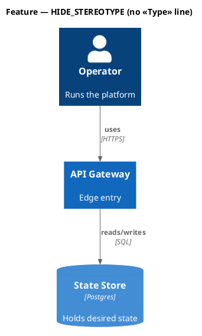
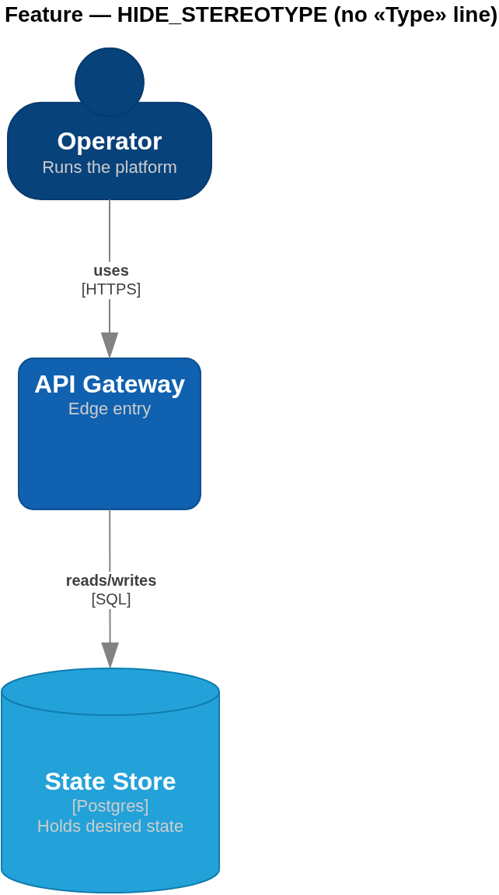
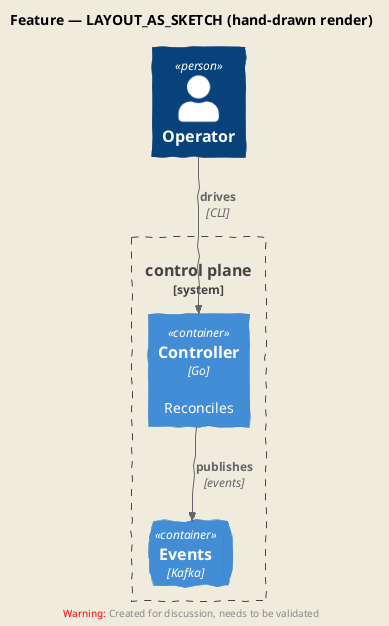
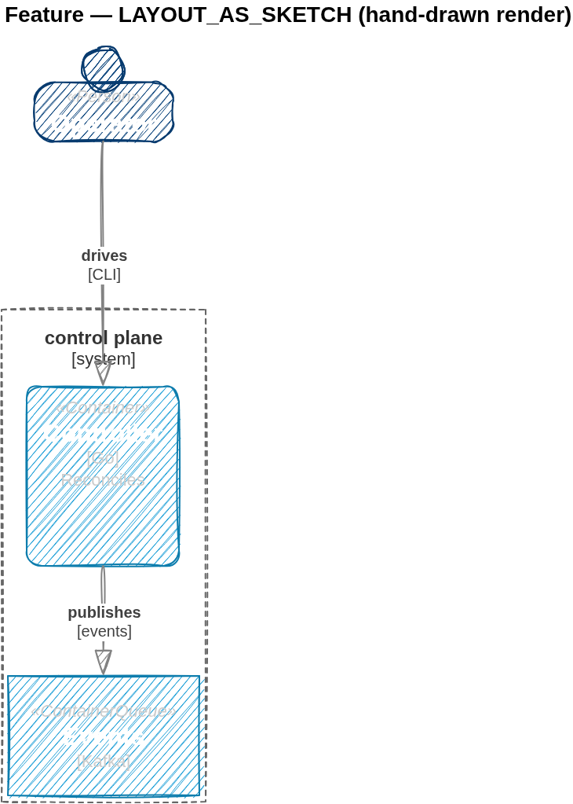

# Conversion gallery — use-case corpus

Generated by `make gallery` (`scripts/gallery.mjs`) from every fixture in
[`tests/fixtures/corpus/`](../../tests/fixtures/corpus/). Each row shows the
**source PlantUML** render next to the **catalyst → draw.io** render.

> PlantUML and draw.io use different layout engines — the two images are
> never pixel-identical. Compare **content**: every box, arrow, verb,
> technology `[in brackets]`, and description must survive. The machine
> gate is [`tests/corpus-sanity.test.mts`](../../tests/corpus-sanity.test.mts).

Regenerate after any engine change: `make gallery && git add docs/gallery/`.

## C4 display/style features

HIDE_STEREOTYPE, sketch (LAYOUT_AS_SKETCH/SET_SKETCH_STYLE), note callouts, legend, AddProperty — each zero-corpus-usage, dedicated fixtures + committed SVG.

### `feat-hide-stereotype.puml`

| Source PlantUML | catalyst → draw.io |
|---|---|
|  |  |

<details><summary>PlantUML source</summary>

```plantuml
@startuml feat-hide-stereotype
!include https://raw.githubusercontent.com/plantuml-stdlib/C4-PlantUML/v2.13.0/C4_Container.puml
HIDE_STEREOTYPE()
title Feature — HIDE_STEREOTYPE (no «Type» line)
Person(op, "Operator", "Runs the platform")
System(api, "API Gateway", "Edge entry")
ContainerDb(db, "State Store", "Postgres", "Holds desired state")
Rel(op, api, "uses", "HTTPS")
Rel(api, db, "reads/writes", "SQL")
@enduml
```

</details>

### `feat-sketch.puml`

| Source PlantUML | catalyst → draw.io |
|---|---|
|  |  |

<details><summary>PlantUML source</summary>

```plantuml
@startuml feat-sketch
!include https://raw.githubusercontent.com/plantuml-stdlib/C4-PlantUML/v2.13.0/C4_Container.puml
LAYOUT_AS_SKETCH()
title Feature — LAYOUT_AS_SKETCH (hand-drawn render)
Person(op, "Operator")
System_Boundary(cp, "control plane") {
  Container(ctl, "Controller", "Go", "Reconciles")
  ContainerQueue(q, "Events", "Kafka")
}
Rel(op, ctl, "drives", "CLI")
Rel(ctl, q, "publishes", "events")
@enduml
```

</details>
