# Sequence-diagram conversion gallery

Generated by `make seq-gallery` (`scripts/seq-gallery.mjs`) from every
fixture in [`tests/fixtures/seq/`](../../tests/fixtures/seq/) — ADR 0007 phases a–d2b.
Each row: the **source PlantUML** `-tsvg` render next to the
**catalyst → draw.io** render.

> Different layout engines — never pixel-identical. Compare **content**:
> every lifeline, message, arrowhead, note, divider, fragment and `ref`
> frame must survive in source order. The deterministic machine gate is
> `make seq-gallery-verify` (the `.drawio` drift gate, CI); the
> structural gate is `tests/seq/SeqConverter.test.mts`.

Regenerate after any seq emit change: `make seq-gallery && git add docs/gallery-seq/`.

## `seq-d2-fragments.puml`

| Source PlantUML | catalyst → draw.io |
|---|---|
|  |  |

<details><summary>PlantUML source</summary>

```plantuml
@startuml seq-d2-fragments
!include https://raw.githubusercontent.com/plantuml-stdlib/C4-PlantUML/v2.14.0/C4_Sequence.puml

title Certificate reconcile — fragments (alt/else, nested loop, opt)

participant "Operator" as op
participant "Controller" as ctl
participant "Vault PKI" as v
participant "K8s Secret" as sec

op -> ctl : create CertificateRequest
activate ctl

alt cert missing or expiring
  ctl ->> v : issue leaf cert
  v --> ctl : signed cert + key
  loop until chain validates
    ctl -> ctl : validate chain
  end
  ctl -> sec : write tls.crt / tls.key
  sec --> ctl : stored
else cert still valid
  ctl -> ctl : no-op (within renewal window)
end

opt notify on change
  ctl -> op : status = Ready
end

deactivate ctl
@enduml
```

</details>

## `seq-d2b-box-boundary.puml`

| Source PlantUML | catalyst → draw.io |
|---|---|
| 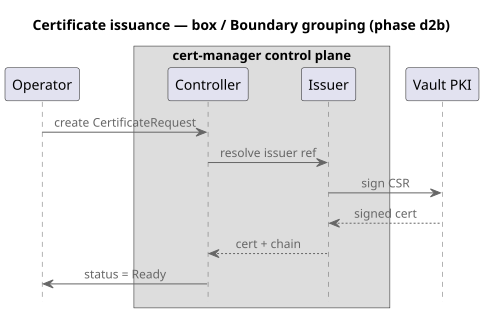 | 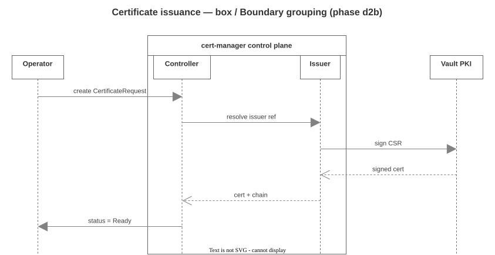 |

<details><summary>PlantUML source</summary>

```plantuml
@startuml seq-d2b-box-boundary
!include https://raw.githubusercontent.com/plantuml-stdlib/C4-PlantUML/v2.14.0/C4_Sequence.puml

title Certificate issuance — box / Boundary grouping (phase d2b)

participant "Operator" as op

box "cert-manager control plane"
participant "Controller" as ctl
participant "Issuer" as iss
end box

participant "Vault PKI" as v

op -> ctl : create CertificateRequest
ctl -> iss : resolve issuer ref
iss -> v : sign CSR
v --> iss : signed cert
iss --> ctl : cert + chain
ctl -> op : status = Ready
@enduml
```

</details>

## `seq-d2b-create-destroy.puml`

| Source PlantUML | catalyst → draw.io |
|---|---|
| 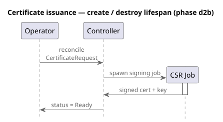 | 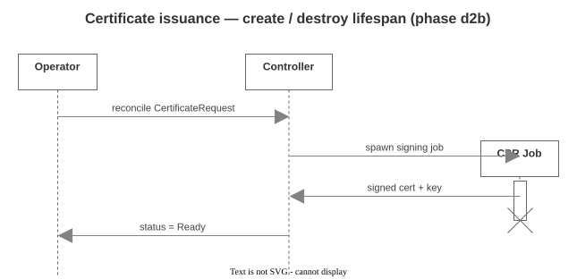 |

<details><summary>PlantUML source</summary>

```plantuml
@startuml seq-d2b-create-destroy
!include https://raw.githubusercontent.com/plantuml-stdlib/C4-PlantUML/v2.14.0/C4_Sequence.puml

title Certificate issuance — create / destroy lifespan (phase d2b)

participant "Operator" as op
participant "Controller" as ctl

op -> ctl : reconcile CertificateRequest
create participant "CSR Job" as job
ctl -> job : spawn signing job
activate job
job -> ctl : signed cert + key
deactivate job
destroy job
ctl -> op : status = Ready
@enduml
```

</details>

## `seq-d2b-ref.puml`

| Source PlantUML | catalyst → draw.io |
|---|---|
|  |  |

<details><summary>PlantUML source</summary>

```plantuml
@startuml seq-d2b-ref
!include https://raw.githubusercontent.com/plantuml-stdlib/C4-PlantUML/v2.14.0/C4_Sequence.puml

title Certificate issuance — ref frames (phase d2b)

participant "Operator" as op
participant "Controller" as ctl
participant "Vault PKI" as v

op -> ctl : create CertificateRequest
ref over ctl, v : standard PKI handshake\n(see Issuance ADR)
ctl ->> v : issue leaf cert
v --> ctl : signed cert + key
ref over op, ctl
  reconcile loop until
  status == Ready
end ref
ctl -> op : status = Ready
@enduml
```

</details>

## `seq-perm-activation.puml`

| Source PlantUML | catalyst → draw.io |
|---|---|
| 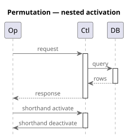 | 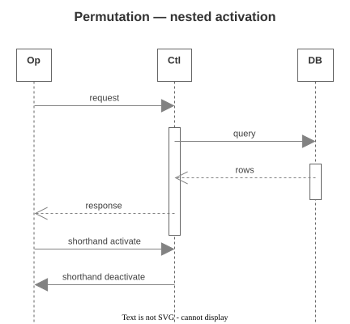 |

<details><summary>PlantUML source</summary>

```plantuml
@startuml seq-perm-activation
!include https://raw.githubusercontent.com/plantuml-stdlib/C4-PlantUML/v2.14.0/C4_Sequence.puml
title Permutation — nested activation
participant "Op" as op
participant "Ctl" as ctl
participant "DB" as db
op -> ctl : request
activate ctl
ctl -> db : query
activate db
db --> ctl : rows
deactivate db
ctl --> op : response
deactivate ctl
op -> ctl ++ : shorthand activate
ctl -> op -- : shorthand deactivate
@enduml
```

</details>

## `seq-perm-arrows.puml`

| Source PlantUML | catalyst → draw.io |
|---|---|
| 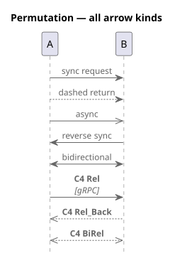 | 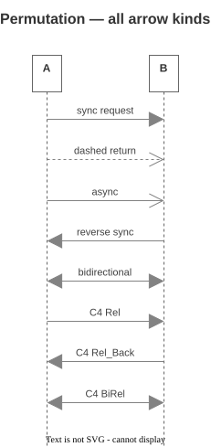 |

<details><summary>PlantUML source</summary>

```plantuml
@startuml seq-perm-arrows
!include https://raw.githubusercontent.com/plantuml-stdlib/C4-PlantUML/v2.14.0/C4_Sequence.puml
title Permutation — all arrow kinds
participant "A" as a
participant "B" as b
a -> b : sync request
a --> b : dashed return
a ->> b : async
a <- b : reverse sync
a <-> b : bidirectional
Rel(a, b, "C4 Rel", "gRPC")
Rel_Back(a, b, "C4 Rel_Back")
BiRel(a, b, "C4 BiRel")
@enduml
```

</details>

## `seq-perm-box.puml`

| Source PlantUML | catalyst → draw.io |
|---|---|
| 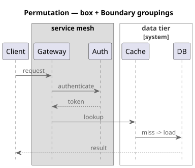 | 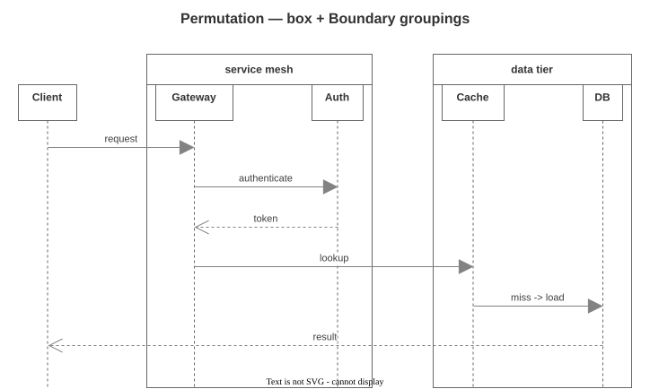 |

<details><summary>PlantUML source</summary>

```plantuml
@startuml seq-perm-box
!include https://raw.githubusercontent.com/plantuml-stdlib/C4-PlantUML/v2.14.0/C4_Sequence.puml
title Permutation — box + Boundary groupings
participant "Client" as cl
box "service mesh"
participant "Gateway" as gw
participant "Auth" as au
end box
System_Boundary(data, "data tier")
participant "Cache" as ca
participant "DB" as db
Boundary_End()
cl -> gw : request
gw -> au : authenticate
au --> gw : token
gw -> ca : lookup
ca -> db : miss -> load
db --> cl : result
@enduml
```

</details>

## `seq-perm-c4-kinds.puml`

| Source PlantUML | catalyst → draw.io |
|---|---|
| 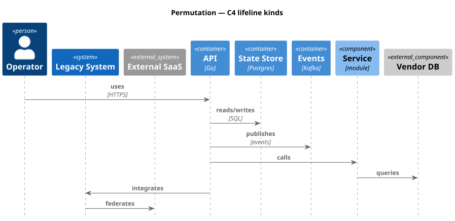 | 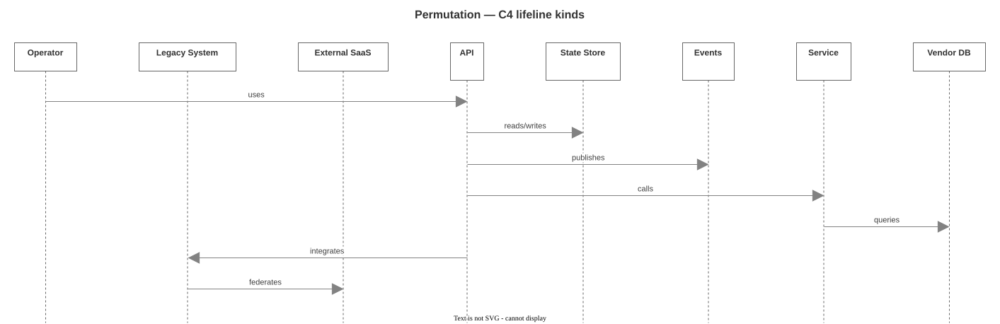 |

<details><summary>PlantUML source</summary>

```plantuml
@startuml seq-perm-c4-kinds
!include https://raw.githubusercontent.com/plantuml-stdlib/C4-PlantUML/v2.14.0/C4_Sequence.puml
title Permutation — C4 lifeline kinds
Person(op, "Operator")
System(sys, "Legacy System")
System_Ext(ext, "External SaaS")
Container(api, "API", "Go")
ContainerDb(cdb, "State Store", "Postgres")
ContainerQueue(cq, "Events", "Kafka")
Component(svc, "Service", "module")
ComponentDb_Ext(edb, "Vendor DB")
Rel(op, api, "uses", "HTTPS")
Rel(api, cdb, "reads/writes", "SQL")
Rel(api, cq, "publishes", "events")
Rel(api, svc, "calls")
Rel(svc, edb, "queries")
Rel(api, sys, "integrates")
Rel(sys, ext, "federates")
@enduml
```

</details>

## `seq-perm-combined.puml`

| Source PlantUML | catalyst → draw.io |
|---|---|
| 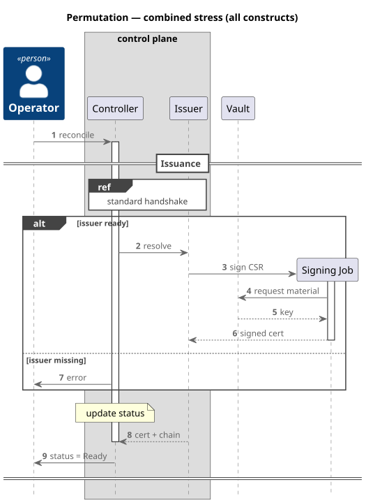 | 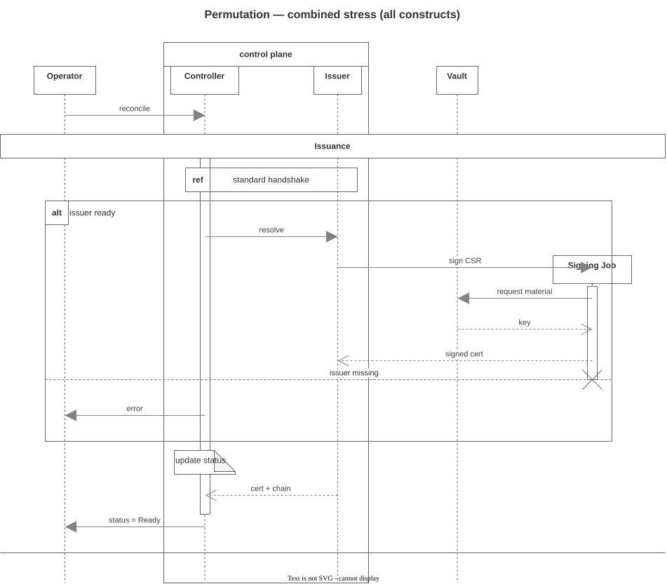 |

<details><summary>PlantUML source</summary>

```plantuml
@startuml seq-perm-combined
!include https://raw.githubusercontent.com/plantuml-stdlib/C4-PlantUML/v2.14.0/C4_Sequence.puml
title Permutation — combined stress (all constructs)
Person(op, "Operator")
box "control plane"
participant "Controller" as ctl
participant "Issuer" as iss
end box
participant "Vault" as v
autonumber
op -> ctl : reconcile
activate ctl
== Issuance ==
ref over ctl, iss : standard handshake
alt issuer ready
ctl -> iss : resolve
create participant "Signing Job" as job
iss -> job : sign CSR
activate job
job -> v : request material
v --> job : key
job --> iss : signed cert
deactivate job
destroy job
else issuer missing
ctl -> op : error
end
note over ctl : update status
iss --> ctl : cert + chain
deactivate ctl
ctl -> op : status = Ready
====
@enduml
```

</details>

## `seq-perm-create-destroy.puml`

| Source PlantUML | catalyst → draw.io |
|---|---|
| 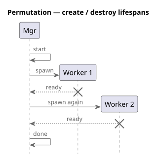 | 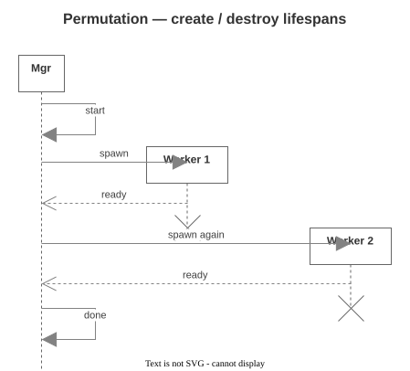 |

<details><summary>PlantUML source</summary>

```plantuml
@startuml seq-perm-create-destroy
!include https://raw.githubusercontent.com/plantuml-stdlib/C4-PlantUML/v2.14.0/C4_Sequence.puml
title Permutation — create / destroy lifespans
participant "Mgr" as m
m -> m : start
create participant "Worker 1" as w1
m -> w1 : spawn
w1 --> m : ready
destroy w1
create participant "Worker 2" as w2
m -> w2 : spawn again
w2 --> m : ready
destroy w2
m -> m : done
@enduml
```

</details>

## `seq-perm-dividers.puml`

| Source PlantUML | catalyst → draw.io |
|---|---|
| 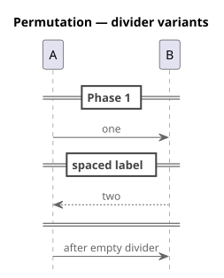 | 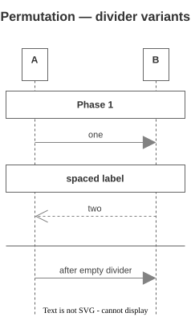 |

<details><summary>PlantUML source</summary>

```plantuml
@startuml seq-perm-dividers
!include https://raw.githubusercontent.com/plantuml-stdlib/C4-PlantUML/v2.14.0/C4_Sequence.puml
title Permutation — divider variants
participant "A" as a
participant "B" as b
== Phase 1 ==
a -> b : one
==  spaced label  ==
b --> a : two
====
a -> b : after empty divider
@enduml
```

</details>

## `seq-perm-fragments-nested.puml`

| Source PlantUML | catalyst → draw.io |
|---|---|
| 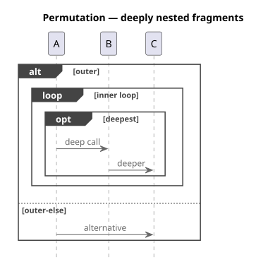 | 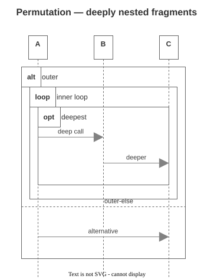 |

<details><summary>PlantUML source</summary>

```plantuml
@startuml seq-perm-fragments-nested
!include https://raw.githubusercontent.com/plantuml-stdlib/C4-PlantUML/v2.14.0/C4_Sequence.puml
title Permutation — deeply nested fragments
participant "A" as a
participant "B" as b
participant "C" as c
alt outer
loop inner loop
opt deepest
a -> b : deep call
b -> c : deeper
end
end
else outer-else
a -> c : alternative
end
@enduml
```

</details>

## `seq-perm-fragments.puml`

| Source PlantUML | catalyst → draw.io |
|---|---|
| 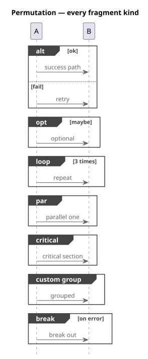 | 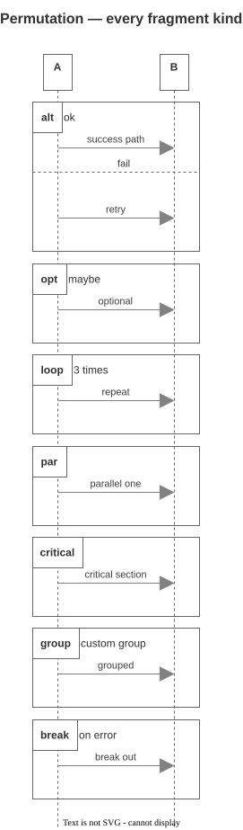 |

<details><summary>PlantUML source</summary>

```plantuml
@startuml seq-perm-fragments
!include https://raw.githubusercontent.com/plantuml-stdlib/C4-PlantUML/v2.14.0/C4_Sequence.puml
title Permutation — every fragment kind
participant "A" as a
participant "B" as b
alt ok
a -> b : success path
else fail
a -> b : retry
end
opt maybe
a -> b : optional
end
loop 3 times
a -> b : repeat
end
par
a -> b : parallel one
end
critical
a -> b : critical section
end
group custom group
a -> b : grouped
end
break on error
a -> b : break out
end
@enduml
```

</details>

## `seq-perm-notes.puml`

| Source PlantUML | catalyst → draw.io |
|---|---|
| 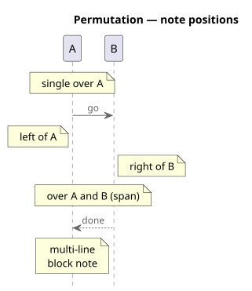 | 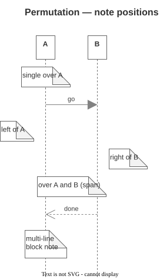 |

<details><summary>PlantUML source</summary>

```plantuml
@startuml seq-perm-notes
!include https://raw.githubusercontent.com/plantuml-stdlib/C4-PlantUML/v2.14.0/C4_Sequence.puml
title Permutation — note positions
participant "A" as a
participant "B" as b
note over a : single over A
a -> b : go
note left of a : left of A
note right of b : right of B
note over a,b : over A and B (span)
b --> a : done
note over a
  multi-line
  block note
end note
@enduml
```

</details>

## `seq-perm-ref.puml`

| Source PlantUML | catalyst → draw.io |
|---|---|
| 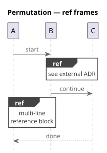 | 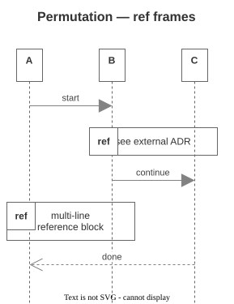 |

<details><summary>PlantUML source</summary>

```plantuml
@startuml seq-perm-ref
!include https://raw.githubusercontent.com/plantuml-stdlib/C4-PlantUML/v2.14.0/C4_Sequence.puml
title Permutation — ref frames
participant "A" as a
participant "B" as b
participant "C" as c
a -> b : start
ref over b, c : see external ADR
b -> c : continue
ref over a, b
  multi-line
  reference block
end ref
c --> a : done
@enduml
```

</details>

## `seq-perm-self-message.puml`

| Source PlantUML | catalyst → draw.io |
|---|---|
| 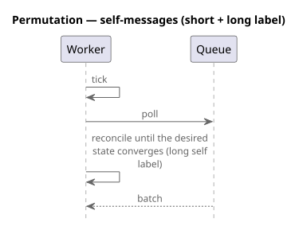 | 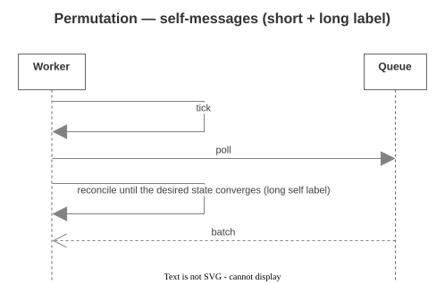 |

<details><summary>PlantUML source</summary>

```plantuml
@startuml seq-perm-self-message
!include https://raw.githubusercontent.com/plantuml-stdlib/C4-PlantUML/v2.14.0/C4_Sequence.puml
title Permutation — self-messages (short + long label)
participant "Worker" as w
participant "Queue" as q
w -> w : tick
w -> q : poll
w -> w : reconcile until the desired state converges (long self label)
q --> w : batch
@enduml
```

</details>

## `seq-v1-cert-lifecycle.puml`

| Source PlantUML | catalyst → draw.io |
|---|---|
|  |  |

<details><summary>PlantUML source</summary>

```plantuml
@startuml seq-v1-cert-lifecycle
!include https://raw.githubusercontent.com/plantuml-stdlib/C4-PlantUML/v2.14.0/C4_Sequence.puml

title Certificate issuance — v1 sequence (no dividers/fragments)

participant "Operator / app" as op
participant "Controller" as ctl
participant "Vault PKI" as v
participant "K8s Secret" as sec

op -> ctl : create CertificateRequest
activate ctl
ctl ->> v : issue leaf cert
v --> ctl : signed cert + key
ctl -> ctl : validate chain
note over ctl : reconcile loop
ctl -> sec : write tls.crt / tls.key
sec --> ctl : stored
ctl -> op : status = Ready
deactivate ctl
@enduml
```

</details>

## `seq-v1-dividers.puml`

| Source PlantUML | catalyst → draw.io |
|---|---|
|  |  |

<details><summary>PlantUML source</summary>

```plantuml
@startuml seq-v1-dividers
!include https://raw.githubusercontent.com/plantuml-stdlib/C4-PlantUML/v2.14.0/C4_Sequence.puml

title Certificate lifecycle — phased (== divider ==, no fragments)

participant "Operator" as op
participant "Controller" as ctl
participant "Vault PKI" as v

== Request ==
op -> ctl : create CertificateRequest
activate ctl

== Issuance ==
ctl ->> v : issue leaf cert
v --> ctl : signed cert + key

== Reconcile ==
ctl -> ctl : validate chain
note over ctl : reconcile loop
ctl -> op : status = Ready
deactivate ctl
====
@enduml
```

</details>
