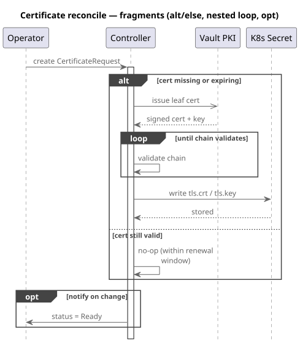
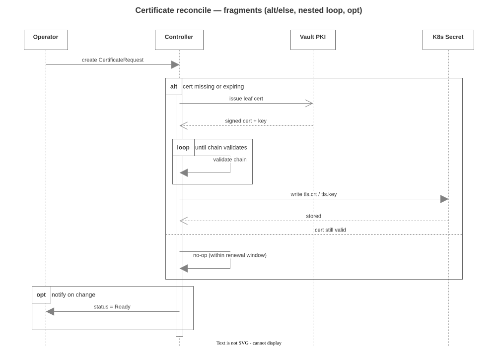
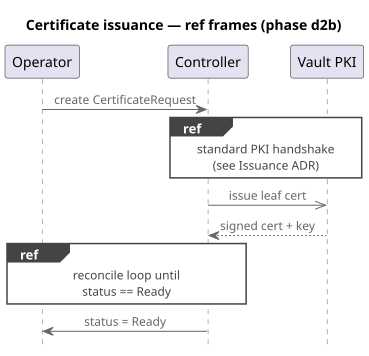
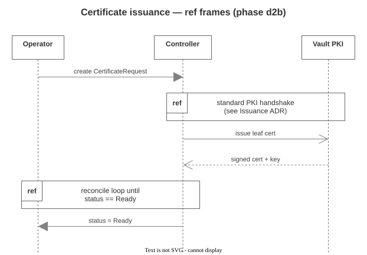
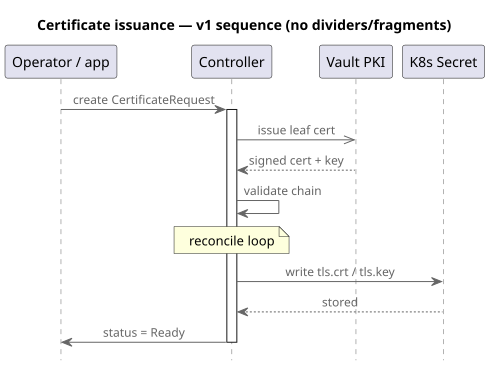
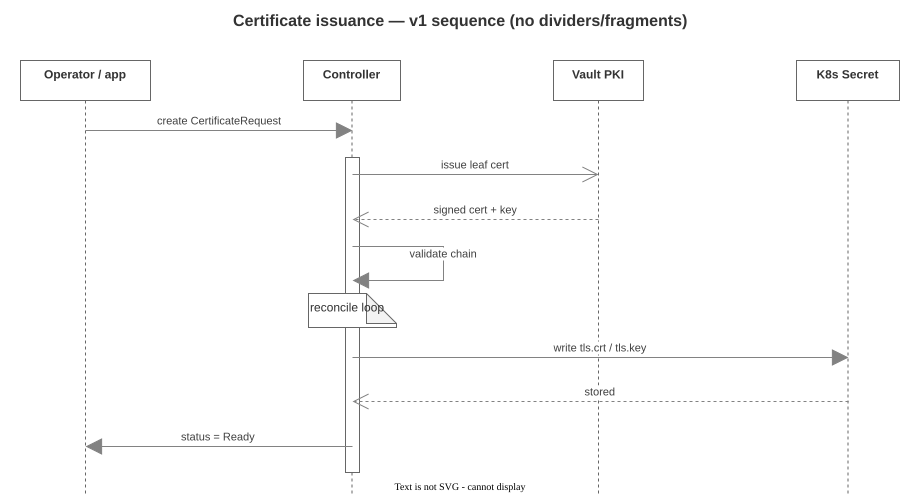
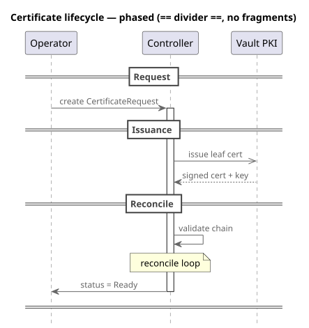
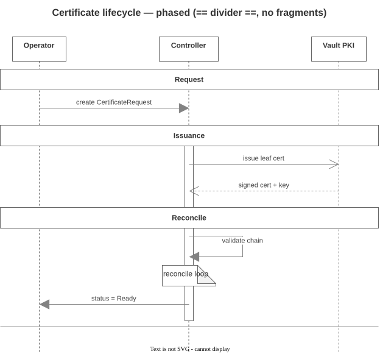

# Sequence-diagram conversion gallery

Generated by `make seq-gallery` (`scripts/seq-gallery.mjs`) from every
fixture in [`tests/fixtures/seq/`](../../tests/fixtures/seq/) — ADR 0007 phases a–d2b.
Each row: the **source PlantUML** `-tsvg` render next to the
**catalyst → draw.io** render.

> Different layout engines — never pixel-identical. Compare **content**:
> every lifeline, message, arrowhead, note, divider, fragment and `ref`
> frame must survive in source order. The deterministic machine gate is
> `make seq-gallery-verify` (the `.drawio` drift gate, CI); the
> structural gate is `tests/seq/SeqConverter.test.mts`.

Regenerate after any seq emit change: `make seq-gallery && git add docs/gallery-seq/`.

## `seq-d2-fragments.puml`

| Source PlantUML | catalyst → draw.io |
|---|---|
|  |  |

<details><summary>PlantUML source</summary>

```plantuml
@startuml seq-d2-fragments
!include https://raw.githubusercontent.com/plantuml-stdlib/C4-PlantUML/v2.13.0/C4_Sequence.puml

title Certificate reconcile — fragments (alt/else, nested loop, opt)

participant "Operator" as op
participant "Controller" as ctl
participant "Vault PKI" as v
participant "K8s Secret" as sec

op -> ctl : create CertificateRequest
activate ctl

alt cert missing or expiring
  ctl ->> v : issue leaf cert
  v --> ctl : signed cert + key
  loop until chain validates
    ctl -> ctl : validate chain
  end
  ctl -> sec : write tls.crt / tls.key
  sec --> ctl : stored
else cert still valid
  ctl -> ctl : no-op (within renewal window)
end

opt notify on change
  ctl -> op : status = Ready
end

deactivate ctl
@enduml
```

</details>

## `seq-d2b-ref.puml`

| Source PlantUML | catalyst → draw.io |
|---|---|
|  |  |

<details><summary>PlantUML source</summary>

```plantuml
@startuml seq-d2b-ref
!include https://raw.githubusercontent.com/plantuml-stdlib/C4-PlantUML/v2.13.0/C4_Sequence.puml

title Certificate issuance — ref frames (phase d2b)

participant "Operator" as op
participant "Controller" as ctl
participant "Vault PKI" as v

op -> ctl : create CertificateRequest
ref over ctl, v : standard PKI handshake\n(see Issuance ADR)
ctl ->> v : issue leaf cert
v --> ctl : signed cert + key
ref over op, ctl
  reconcile loop until
  status == Ready
end ref
ctl -> op : status = Ready
@enduml
```

</details>

## `seq-v1-cert-lifecycle.puml`

| Source PlantUML | catalyst → draw.io |
|---|---|
|  |  |

<details><summary>PlantUML source</summary>

```plantuml
@startuml seq-v1-cert-lifecycle
!include https://raw.githubusercontent.com/plantuml-stdlib/C4-PlantUML/v2.13.0/C4_Sequence.puml

title Certificate issuance — v1 sequence (no dividers/fragments)

participant "Operator / app" as op
participant "Controller" as ctl
participant "Vault PKI" as v
participant "K8s Secret" as sec

op -> ctl : create CertificateRequest
activate ctl
ctl ->> v : issue leaf cert
v --> ctl : signed cert + key
ctl -> ctl : validate chain
note over ctl : reconcile loop
ctl -> sec : write tls.crt / tls.key
sec --> ctl : stored
ctl -> op : status = Ready
deactivate ctl
@enduml
```

</details>

## `seq-v1-dividers.puml`

| Source PlantUML | catalyst → draw.io |
|---|---|
|  |  |

<details><summary>PlantUML source</summary>

```plantuml
@startuml seq-v1-dividers
!include https://raw.githubusercontent.com/plantuml-stdlib/C4-PlantUML/v2.13.0/C4_Sequence.puml

title Certificate lifecycle — phased (== divider ==, no fragments)

participant "Operator" as op
participant "Controller" as ctl
participant "Vault PKI" as v

== Request ==
op -> ctl : create CertificateRequest
activate ctl

== Issuance ==
ctl ->> v : issue leaf cert
v --> ctl : signed cert + key

== Reconcile ==
ctl -> ctl : validate chain
note over ctl : reconcile loop
ctl -> op : status = Ready
deactivate ctl
====
@enduml
```

</details>
